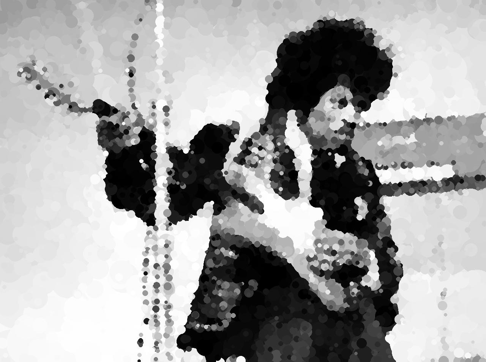

# Hill Climbing Art - with Python

Implements a [Hill Climbing algorithm](https://en.wikipedia.org/wiki/Hill_climbing) to replicate a 
target greyscale (only, for now) image by drawing random circles. 

## Overview
This hill climbing algorithm attempts to replicate a target image by drawing random circles on a blank canvas. 
Circles that make the generated image more similar to the target image are kept while those that make the 
generated image less similar are discarded.  

This image of Jimi Hedrix was generated with 100,000 epochs. 3,925 of the circles improved the generated
image and were used in the final while the remaining circles were discarded. Running this took just under 
7 minutes my old MacBook, about 0.004 seconds / epoch. 

[Original image source](https://commons.wikimedia.org/wiki/File:Jimi_Hendrix_1967_uncropped.jpg)

## Details
At first the script draws large circles but the circle size quickly decreases as the number of epochs 
increases. Many more small circles are required to flush out some of the finer details in the target image - 
like the mic cord in the image above. Also, the script requires many more guesses with smaller circles 
since smaller circles are less likely to fall on a part of the image that requires fine detail 
or to meaningfully decrease the difference to the target image. 

## Future improvements
- Shapes besides circles
- Colored images
- Allow new circles that make the generated image more different, as long as difference is within a given limit. 
- Choose average circle size using variance of the difference image array. 
- Choose the average circle color to be the color of the pixel at the circle center point, with some variance. 