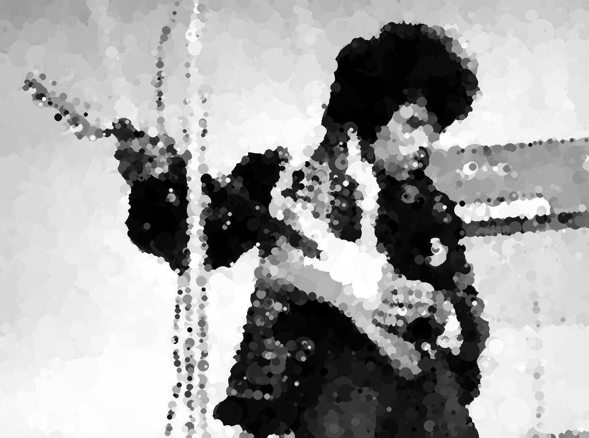
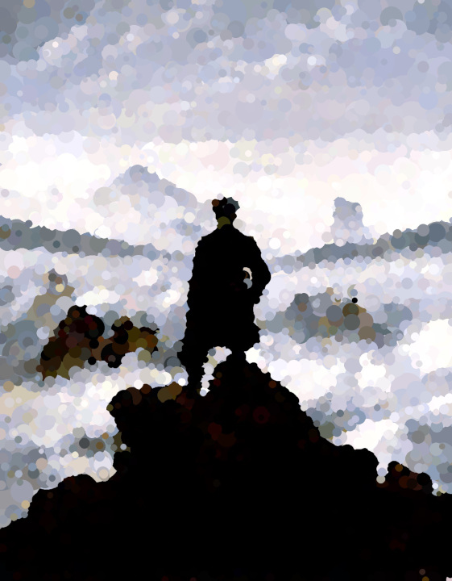

# Hill Climbing Art

Implements a [hill climbing algorithm](https://en.wikipedia.org/wiki/Hill_climbing) that replicates a target image by drawing random circles. 



Target image [source](https://commons.wikimedia.org/wiki/File:Jimi_Hendrix_1967_uncropped.jpg)


## Contents
- [Overview](#overview)
- [Examples](#examples)
- [Color Modes](#color-modes)
    - [Using specific color channels](#using-specific-color-channels)
    - [Using the target image palette](#using-the-target-image-palette)
    - [The alpha channel](#the-alpha-channel)
- [Other Settings](#other-settings)
- [Future Improvements](#future-improvements)

## Overview
The script starts with a blank generated image and a given target image. 
At each epoch it
1. Draws a random circle on the generated image
2. Calculates the difference between the generated image with the new random circle and the target image
3. Either:  
    a. Keeps the new circle if it decreases the difference  
    b. Discards the new circle otherwise

The difference measure calculation is `np.array(ImageChops.difference(im_target, im_generated)).mean() / 255`. 
E.g. the average, absolute difference between the pixel values in each image, standardized by the range of the 8-bit pixels. 

## Examples
I generated the above image of Jimi Hendrix using the following code. 

```python
target_image_path = 'images/Jimi_Hendrix_1967_uncropped.jpg'

hca = HillClimbingArtist()

hca.max_iterations = 100_000  # number of circles to try
hca.set_seed(1111)            # reproducibility
hca.start_radius = 70         # starting cirle radius
hca.end_radius = 3
hca.alpha_stretch = 1000      # controls exponential decrease of circle size - larger => faster decrease
hca.color_mode = 'L'          # grayscale

hca.load_target_image(target_image_path, resize_mult=0.5)
hca.save_climbing_gif('images/climbing_progress.gif')

hca.climb()

hca.save(dir='images', im_name='jimi_on_guitar.jpg')
```
Running this took just under 3 minutes my 2015 MacBook, about 0.0017 seconds / epoch. 
Only 3,885 circles increased the similarity with the target and were included in the final image. 
The difference with the target image is 6.2%. 

## Color Modes
The algo defaults to using the color mode of the target image. 
However you can set the color mode by assigning the `HillClimbingArtist.color_mode` attribute to a string. 
See the documentation for [Pillow color modes](https://pillow.readthedocs.io/en/stable/handbook/concepts.html#concept-modes). 

The look of color images changes depending on the specific color mode used. 
For example, compare these two generated images of the Python logo created with the [RGB](https://en.wikipedia.org/wiki/HSL_and_HSV) and [HSV](https://en.wikipedia.org/wiki/HSL_and_HSV) color modes. 

`hca.color_mode = 'RGB'`


`hca.color_mode = 'HSV'`


### Using specific color channels
You can constrain the algo to only work with specific color channels. 
Assign the `HillClimbingArtist.channels_to_climb` attribute to a `numpy.array` of `bool` where a `True` element indicates the algo should climb that channel. 

For example, here the algo estimates only the hue and saturation channels of the Python logo. 
```python
hca.color_mode = 'HSV'
hca.channels_to_climb = np.array((True, True, False))  # estimate H, S but not V
```


## Using the target image palette
Setting `color_choice='target_palette'` means that the script will sample pixel colors from the target image. 
I find this provides a nice balance for color images where choosing completely random colors generally doesn't look great. 



[Original at Wikimedia commons](https://commons.wikimedia.org/wiki/File:Caspar_David_Friedrich_-_Wanderer_above_the_Sea_of_Fog.jpeg)

## The alpha channel
Choosing a color mode with an alpha channel means the shapes will have variable transparency which decreases the hard edges and looks cool for some target images. 

__Note:__ 
Currently if you set `color_choice='target_palette'` and use a color mode with an alpha channel the script won't add any alpha to the shapes unless the target image has some alpha. 
I'd like to change this at some point. 

## Other Settings
- `channels_to_climb`: a Numpy array of bool indicating which color channels the algo should use. 
For example `channels_to_climb = np.array((True, False, False))` with the RGB color mode means the algo will only estimate the red channel. 
- `set_seed(seed: int)` sets the seed. 
Each `HillClimbingArtist` class instance is initiated with a random seed which you can access with the `seed` attribute. 
- `target_difference_percent`: if set the algo will run until the difference is less that this value. 
- `start_radius`, `end_radius`: the starting and ending radius of random the circles. 
- `radius_percent_variance`: float in [0, 1), default 0.2. Each circle radius varies by up to 1+/- this amount. 
- `alpha_func` - `string`: the function controlling how the circle radius decreases with epochs. 
Options are `loglike` (default), `sigmoid`, `linear`. 

## Future Improvements
- [ ] Shapes besides circles
- [ ] Allow for approximating each channel separately
- [ ] Allow shapes with random alpha when using `color_choice = 'target_palette'`
- [x] Colored images
