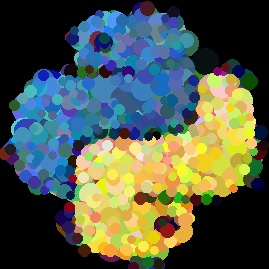
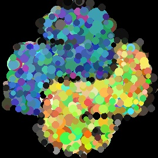
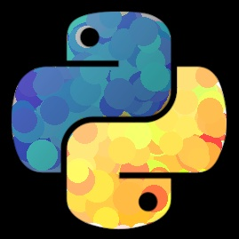

# Hill Climbing Art

Implements a [Hill Climbing algorithm](https://en.wikipedia.org/wiki/Hill_climbing) to replicate a target image by drawing random circles. 


[Original image source](https://commons.wikimedia.org/wiki/File:Jimi_Hendrix_1967_uncropped.jpg)

## Overview
This hill climbing algo draws random circles on a blank canvas. 
Circles that make the generated image more similar to the target image are kept while those that make the 
generated image less similar are discarded.  

## Examples
I generated the image of Jimi Hendrix above using the following code. 

```python
target_image_path = 'images/Jimi_Hendrix_1967_uncropped.jpg'

hca = HillClimbingArtist()

hca.max_iterations = 100_000
hca.color_mode = 'L'

hca.load_target_image(target_image_path)

hca.climb()

hca.im_generated.show()
```
Running this took just under 7 minutes my 2015 MacBook, about 0.004 seconds / epoch. 
The `hca.color_mode = 'L'` constrains the algo to grayscale. 

### Color Modes
The algo defaults to using the color mode of the target image. 
However you can set the color mode by assigning the `HillClimbingArtist.color_mode` attribute to a string. 
See the documentation for [Pillow color modes](https://pillow.readthedocs.io/en/stable/handbook/concepts.html#concept-modes). 

The look of color images changes depending on the specific color mode used. 
For example, compare these two generated images of the Python logo created with the [RGB](https://en.wikipedia.org/wiki/HSL_and_HSV) and [HSV](https://en.wikipedia.org/wiki/HSL_and_HSV) color modes. 

__RGB__ `hca.color_mode = 'RGB'`



__HSV__ `hca.color_mode = 'HSV'`



### Using specific color channels
You can constrain the algo to only work with specific color channels. 
Assign the `HillClimbingArtist.channels_to_climb` attribute to a `numpy.array` of `bool` where a `True` element indicates the algo should climb that channel. 

For example, here the algo estimates only the hue and saturation channels of the Python logo. 
```python
hca.color_mode = 'HSV'
hca.channels_to_climb = np.array((True, True, False))  # estimate H, S but not V
```


## Future improvements
- [ ] Shapes besides circles
- [x] Colored images
- [ ] Choose the average circle color to be the color of the pixel at the circle center point. 
